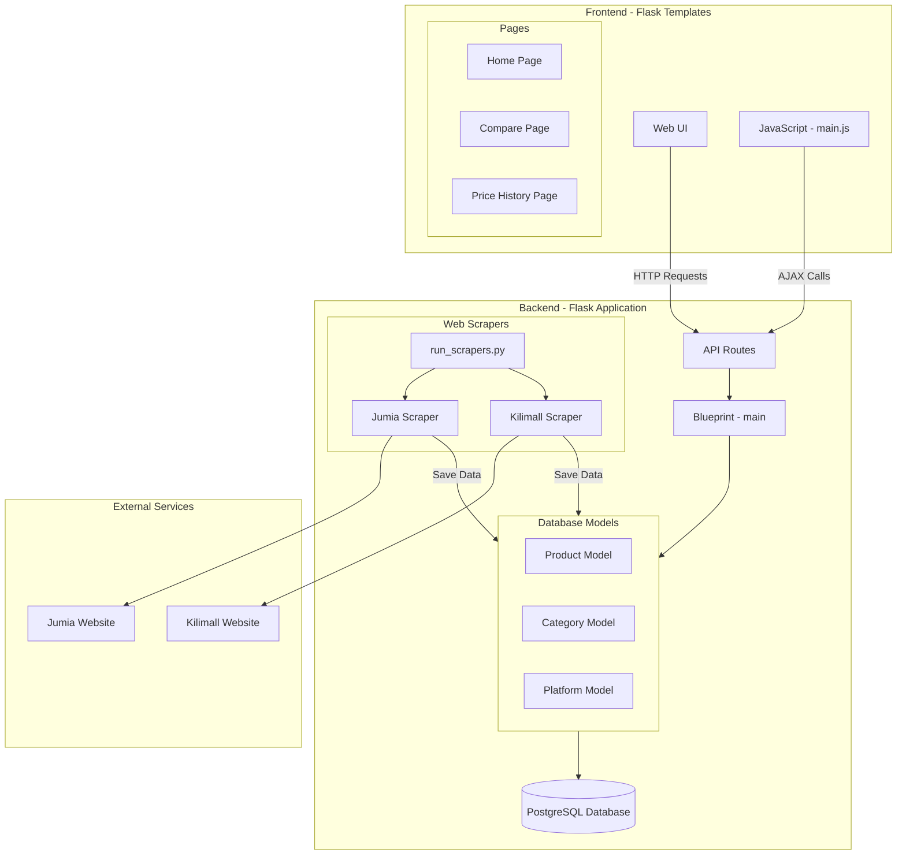

# Price Tracker Application Architecture

## Component Description

### Frontend
- **Web UI**: Browser-based interface built with HTML, CSS (Bootstrap), and JavaScript
- **Pages**:
  - Home Page: Product listing with filters
  - Compare Page: Side-by-side product comparison
  - Price History Page: Historical price trends
- **JavaScript**: Handles dynamic UI updates and API calls

### Backend
- **API Routes**: RESTful endpoints for product data
- **Blueprint**: Flask Blueprint for route organization
- **Database Models**:
  - Product: Stores product details and price history
  - Category: Product categories (e.g., Mobile Phones, Televisions)
  - Platform: E-commerce platforms (Jumia, Kilimall)
- **Web Scrapers**:
  - Jumia Scraper: Scrapes product data from Jumia
  - Kilimall Scraper: Scrapes product data from Kilimall
  - run_scrapers.py: Orchestrates scraping operations

### External Services
- **E-commerce Websites**:
  - Jumia: Source for product data
  - Kilimall: Source for product data

## Data Flow
1. Scrapers periodically fetch product data from e-commerce websites
2. Data is processed and stored in SQLite database
3. Frontend makes API calls to retrieve data
4. UI components render data and handle user interactions

## Key Features
- Real-time product price tracking
- Historical price analysis
- Product comparison
- Category-based filtering
- Multi-platform support
