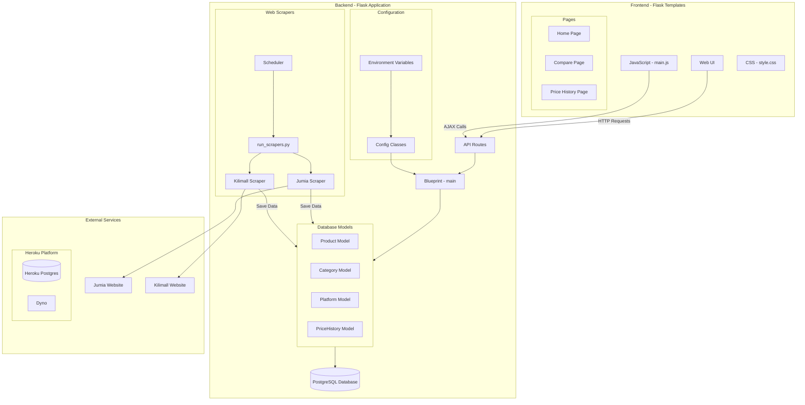

# Price Tracker Application Architecture

## System Overview

The Price Tracker is a web application that monitors and compares product prices across major e-commerce platforms in Kenya. Built with Flask and modern web technologies, it provides real-time price tracking and historical price analysis.

## Component Description

### Frontend
- **Web UI**: Modern, responsive interface built with:
  - HTML5 for structure
  - Bootstrap 5 for layout and components
  - Custom CSS for styling
  - Font Awesome for icons
- **Pages**:
  - Home Page: Product listing with dynamic filters and platform statistics
  - Compare Page: Side-by-side product comparison with price history charts
  - Price History Page: Detailed price trends and analytics
- **JavaScript**: 
  - AJAX for asynchronous data loading
  - Interactive charts using Plotly.js
  - Dynamic UI updates and filtering
- **CSS**:
  - Custom styling for platform cards and components
  - Responsive design breakpoints
  - Animation and transition effects

### Backend
- **API Routes**: RESTful endpoints organized using Flask Blueprints:
  - /api/v1/products: Product listing and filtering
  - /api/v1/categories: Category management
  - /api/v1/platforms: Platform information
  - /api/v1/stats: Platform statistics
- **Database Models**:
  - Product: Core product information and relationships
  - Category: Product categorization
  - Platform: E-commerce platform details
  - PriceHistory: Historical price data with timestamps
- **Web Scrapers**:
  - Platform-specific scrapers with error handling
  - Scheduled execution using APScheduler
  - Data validation and cleaning
  - Rate limiting and retry logic

### Infrastructure
- **Hosting**: Heroku Platform
  - Web: Gunicorn WSGI server
  - Database: Heroku Postgres
  - Environment: Python 3.9 runtime
- **Dependencies**:
  - Flask 2.3.3 for web framework
  - SQLAlchemy 1.4 for ORM
  - Requests for HTTP client
  - BeautifulSoup4 for HTML parsing
  - Selenium for dynamic content scraping

## Data Flow
1. **Data Collection**:
   - Scrapers run on scheduled intervals
   - Extract product data from e-commerce platforms
   - Clean and validate data
   - Store in PostgreSQL database

2. **API Layer**:
   - RESTful endpoints handle client requests
   - Data filtering and pagination
   - JSON response formatting
   - Error handling and logging

3. **Frontend Interaction**:
   - Dynamic page loading
   - Real-time price updates
   - Interactive charts and filters
   - Responsive UI updates

## Security Features
- CORS protection
- SQL injection prevention through SQLAlchemy
- Environment variable configuration
- Rate limiting on API endpoints
- Secure database connection strings

## Monitoring and Logging
- Heroku application logs
- Custom error tracking
- Database query monitoring
- Scraper performance metrics

## Future Enhancements
- Additional e-commerce platforms
- Price alert notifications
- User accounts and favorites
- Mobile application
- Advanced analytics and predictions
- Caching layer for improved performance
