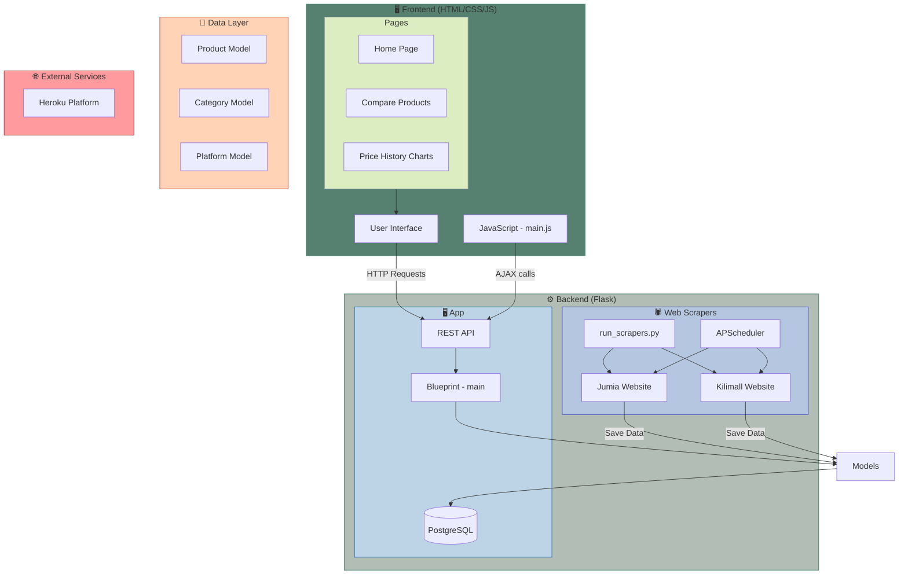
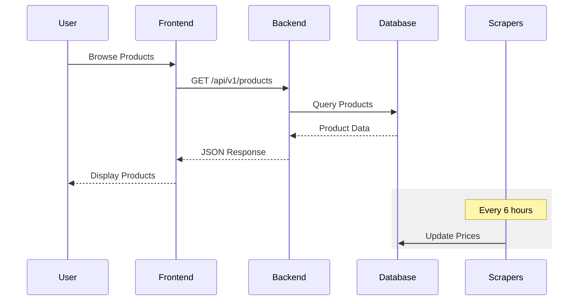

# WPP Price Tracker Architecture

> A modern web application for tracking product prices across multiple e-commerce platforms

## System Overview



## System Components

### Frontend Layer 🎨
<div style="background: linear-gradient(135deg, #a8e6cf 0%, #dcedc1 100%); padding: 15px; border-radius: 8px; border-left: 5px solid #3d8168;">

#### Core Components
- **Templates** (`app/templates/`)
  - `base.html`: Base template with common layout
  - `index.html`: Homepage with product listings
  - `compare.html`: Product comparison interface

#### Static Assets
- **JavaScript** (`app/static/js/`)
  - Price history charts using Chart.js
  - Dynamic product comparison
  - AJAX data fetching
- **CSS** (`app/static/css/`)
  - Bootstrap 5 customization
  - Responsive design
</div>

### Backend Layer ⚙️
<div style="background: linear-gradient(135deg, #bcd4e6 0%, #d6e2e9 100%); padding: 15px; border-radius: 8px; border-left: 5px solid #2b6cb0;">

#### API Routes (`app/routes.py`)
```python
GET  /api/v1/products     # List products with filters
GET  /api/v1/products/:id # Get single product
GET  /api/v1/categories   # List categories
GET  /api/v1/platforms    # List platforms
GET  /api/v1/stats        # Get price statistics
```

#### Models (`app/models/models.py`)
- `Product`: Product information and price history
- `Platform`: E-commerce platform details
- `Category`: Product categorization
</div>

### Data Layer 💾
<div style="background: linear-gradient(135deg, #ffd3b6 0%, #ffaaa5 100%); padding: 15px; border-radius: 8px; border-left: 5px solid #c53030;">

#### Database Schema
```sql
Products
  - id (PK)
  - name
  - url
  - image_url
  - current_price
  - platform_id (FK)
  - category_id (FK)
  - price_history (JSON)
  - created_at
  - updated_at

Platforms
  - id (PK)
  - name
  - base_url

Categories
  - id (PK)
  - name
```
</div>

### Scraping System 🕷️
<div style="background: linear-gradient(135deg, #b5c6e0 0%, #ebf4f5 100%); padding: 15px; border-radius: 8px; border-left: 5px solid #4c51bf;">

#### Components
- **Base Scraper** (`app/scrapers/base.py`)
  - Common scraping functionality
  - Rate limiting and retry logic
  
- **Platform Scrapers**
  - `jumia_scraper.py`: Jumia products
  - `kilimall_scraper.py`: Kilimall products
  
- **Scheduler**
  - Automated scraping every 6 hours
  - Price history updates
</div>

## Data Flow 🔄
<div style="background: linear-gradient(135deg, #c9d6ff 0%, #e2e2e2 100%); padding: 15px; border-radius: 8px; border-left: 5px solid #434190;">


</div>

## Project Structure 📁
<div style="background: linear-gradient(135deg, #e2cfc4 0%, #f7d794 100%); padding: 15px; border-radius: 8px; border-left: 5px solid #975a16;">

```
wpp-price_tracker/
├── app/
│   ├── models/
│   │   └── models.py          # Database models
│   ├── scrapers/
│   │   ├── base.py           # Base scraper class
│   │   ├── jumia_scraper.py  # Jumia implementation
│   │   ├── kilimall_scraper.py # Kilimall implementation
│   │   └── run_scrapers.py   # Scraper orchestration
│   ├── static/
│   │   ├── css/             # Stylesheets
│   │   └── js/              # Frontend scripts
│   ├── templates/           # HTML templates
│   ├── __init__.py         # App initialization
│   └── routes.py           # API endpoints
├── doc/
│   └── architecture.md     # This document
├── migrations/            # Database migrations
├── .env                  # Environment variables
├── config.py             # App configuration
├── Procfile             # Heroku deployment
├── requirements.txt     # Python dependencies
└── run.py              # App entry point
```
</div>

## Development & Deployment 🚀
<div style="background: linear-gradient(135deg, #d4fc79 0%, #96e6a1 100%); padding: 15px; border-radius: 8px; border-left: 5px solid #2f855a;">

### Tools & Services
- **Version Control**: Git
- **Database**: PostgreSQL on Heroku
- **Hosting**: Heroku Platform
- **Monitoring**: Heroku Logs

### Environment Setup
```bash
# Installation
pip install -r requirements.txt

# Database Setup
python run.py init

# Run Development Server
python run.py run

# Run Scrapers
python run.py scrape
```
</div>

## Security Measures 🔒
<div style="background: linear-gradient(135deg, #ff9a9e 0%, #fecfef 100%); padding: 15px; border-radius: 8px; border-left: 5px solid #9b2c2c;">

### Implemented Features
- SQL Injection Protection (SQLAlchemy)
- Input Validation
- Error Handling
- CORS Configuration

### Best Practices
- Environment Variable Usage
- Secure Database Connections
- Rate Limiting for Scrapers
</div>
